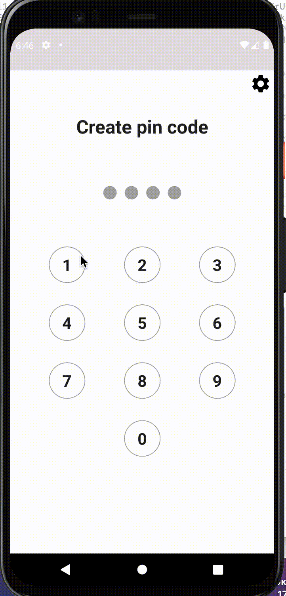

# Pin code entry implementation

  This application has been written during internship. The main goal was to get acquainted and applied following technologies and patterns:
  
- MVP (Model-View-Presenter) pattern gave me the basic principles of creation application using clean architecture paradigm
- JUnit 5 all business logic has been covered tests
- Android Key Store has been used for encryption and decryption saved pin code
- Dark/Light theme have been installed
- Recycler View
- Activities/fragments relationships and lifecycles have been studied
- Clean code

